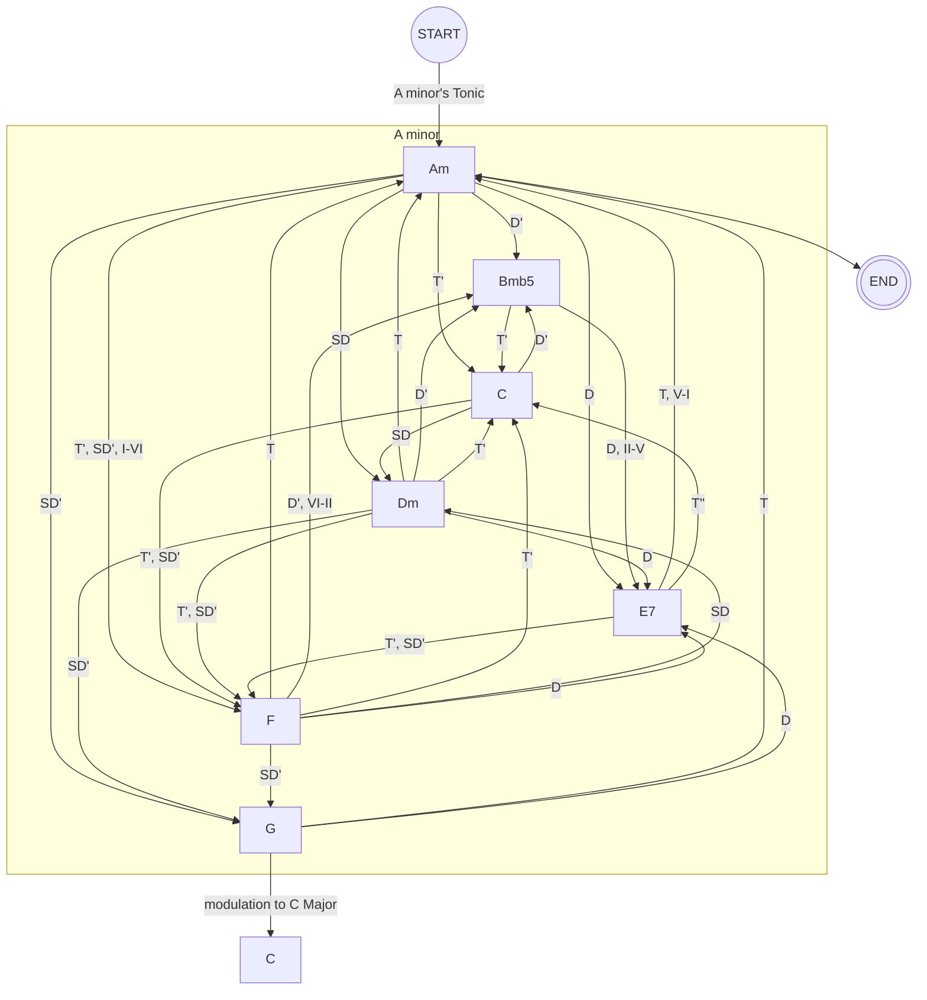

```mermaid
flowchart TB
  %% COMMON
  S((START));
  Q(((END)));

  S --"A minor's Tonic" --> Am;
  subgraph "A minor"
    direction TB;

    E7_Am[E7];

    %%  Am
    Am --"D'"--> Bmb5;
    Am --"T'"--> C;
    Am -- "SD" --> Dm;
    Am -- "D" --> E7_Am;
    Am -- "T', SD', I-VI" --> F;
    Am -- "SD'" --> G;

    %% Bmb5
    Bmb5 -- T' --> C;
    Bmb5 -- "D, II-V" --> E7_Am;

    %% C トニック代理
    C-- "D'" -->Bmb5;
    C-- "SD" -->Dm;
    C-- "T', SD'" -->F;

    %% Dm
    Dm -- "T" --> Am;
    Dm -- "D'" --> Bmb5;
    Dm -- "T'" --> C;
    Dm -- "D" --> E7_Am;
    Dm -- "T', SD'" --> F;
    Dm -- "SD'" --> G;

    %% E7
    E7_Am -- "T, V-I" --> Am;
    E7_Am -- "T''" --> C;
    E7_Am -- "T', SD' " --> F;

    %% F　トニック代理、サブドミナント代理
    F -- "T" --> Am;
    F-- "D', VI-II" -->Bmb5;
    F -- "T'" --> C;
    F --"SD"--> Dm;
    F -- "D" --> E7_Am;
    F -- "SD'" -->G;

    %% G　サブドミナント代理
    G -- "T" --> Am;
    G -- "D" --> E7_Am;
  end
  
  G -- "modulation to C Major" --> C_CM[C];
  Am --> Q;
```
