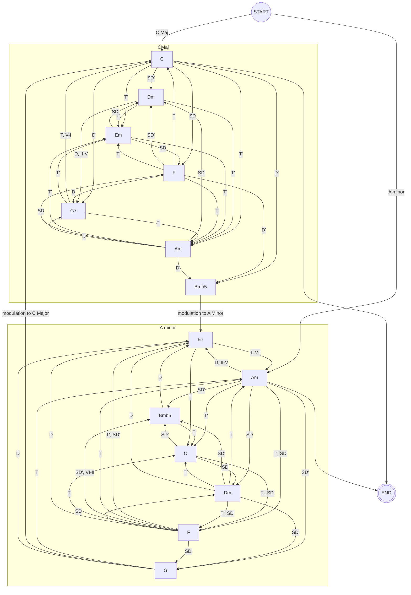

```mermaid
flowchart TB
  %% COMMON
  S((START));
  Q(((END)));
  
  %% C Major
  S --"C Maj"--> C_CM;
  subgraph "CMaj"
    direction TB;

    C_CM[C];
    Dm_CM[Dm];
    Em_CM[Em];
    F_CM[F];
    G7_CM[G7];
    Am_CM[Am];
    Bmb5_CM[Bmb5];

    %% C
    C_CM-- "SD'" -->Dm_CM;
    C_CM-- "T'" -->Em_CM;
    C_CM-- "SD" -->F_CM;
    C_CM-- "D" -->G7_CM;
    C_CM-- "T'" -->Am_CM;
    C_CM-- "D'" -->Bmb5_CM;

    %% Dm
    Dm_CM -- T' --> Em_CM;
    Dm_CM -- D, II-V --> G7_CM;
    Dm_CM -- T' --> Am_CM;

    %% Em
    Em_CM -- SD' --> Dm_CM;
    Em_CM -- SD --> F_CM;
    Em_CM -- T' --> Am_CM;

    %% F
    F_CM -- "T" --> C_CM;
    F_CM --"SD'"--> Dm_CM;
    F_CM -- "T'" --> Em_CM;
    F_CM --"D"--> G7_CM;
    F_CM -- "T'" --> Am_CM;
    F_CM -- "D'" --> Bmb5_CM;

    %% G7
    G7_CM -- "T, V-I" --> C_CM;
    G7_CM -- "T'" --> Em_CM;
    G7_CM -- "T'" --> Am_CM;

    %%  Am
    Am_CM -- "SD'" --> Dm_CM;
    Am_CM -- "T'" --> Em_CM;
    Am_CM -- "SD" --> F_CM;
    Am_CM -- "D" --> G7_CM;
    Am_CM --"D'"--> Bmb5_CM;
  end

  %% Bmb5
  Bmb5_CM --"modulation to A Minor"--> E7_Am;
  %% quit
  C_CM --> Q;


  %% A Minor
  S --A minor --> Am;
  subgraph "A minor"
    direction TB;

    E7_Am[E7];

    %%  Am
    Am --"SD'"--> Bmb5;
    Am --"T'"--> C;
    Am -- "SD" --> Dm;
    Am -- "D, II-V" --> E7_Am;
    Am -- "T', SD'" --> F;
    Am -- "SD'" --> G;

    %% Bmb5
    Bmb5 -- T' --> C;
    Bmb5 -- D --> E7_Am;

    %% C トニック代理
    C-- "SD'" -->Bmb5;
    C-- "SD" -->Dm;
    C-- "T', SD'" -->F;

    %% Dm
    Dm -- "T" --> Am;
    Dm -- "SD'" --> Bmb5;
    Dm -- "T'" --> C;
    Dm -- "D" --> E7_Am;
    Dm -- "T', SD'" --> F;
    Dm -- "SD'" --> G;

    %% E7
    E7_Am -- "T, V-I" --> Am;
    E7_Am -- "T'" --> C;
    E7_Am -- "T', SD' " --> F;

    %% F　トニック代理、サブドミナント代理
    F -- "T" --> Am;
    F-- "SD', VI-II" -->Bmb5;
    F -- "T'" --> C;
    F --"SD"--> Dm;
    F -- "D" --> E7_Am;
    F -- "SD'" -->G;

    %% G　サブドミナント代理
    G -- "T" --> Am;
    G -- "modulation to C Major" --> C_CM;
    G -- "D" --> E7_Am;
  end
  %% Quit
  Am ----> Q;
```
