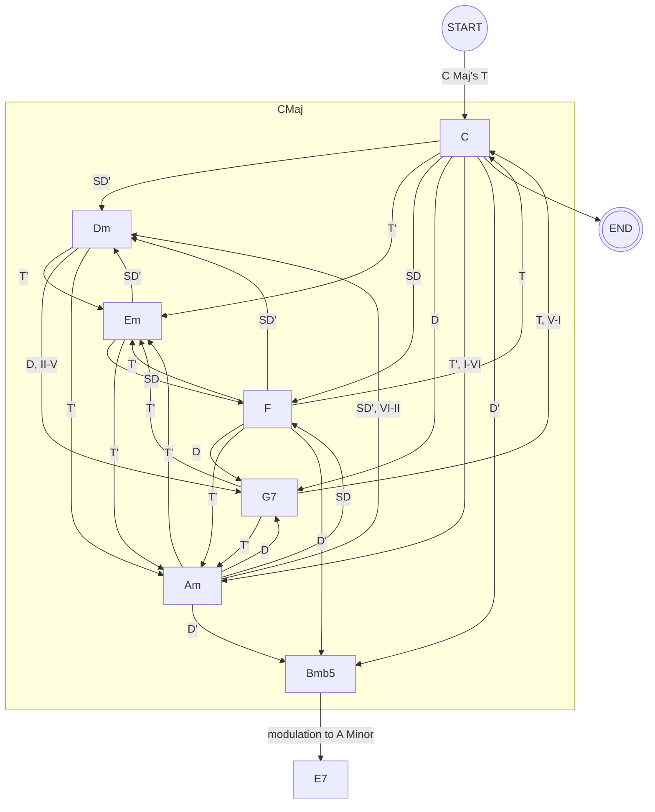

- T: Tonic chords
- T': substitute Tonic chords
- SD: Sub Dominant chords
- SD': substitute Sub Dominant chords
- D: Dominant chords
- D': substitute Dominant chords

```mermaid

flowchart TB
  %% COMMON
  S((START));
  Q(((END)));
  S --"C Maj's T"--> C_CM;

  subgraph "CMaj"
    direction TB;

    C_CM[C];
    Dm_CM[Dm];
    Em_CM[Em];
    F_CM[F];
    G7_CM[G7];
    Am_CM[Am];
    Bmb5_CM[Bmb5];

    %% C
    C_CM-- "SD'" -->Dm_CM;
    C_CM-- "T'" -->Em_CM;
    C_CM-- "SD" -->F_CM;
    C_CM-- "D" -->G7_CM;
    C_CM-- "T', I-VI" -->Am_CM;
    C_CM-- "D'" -->Bmb5_CM;

    %% Dm
    Dm_CM -- T' --> Em_CM;
    Dm_CM -- D, II-V --> G7_CM;
    Dm_CM -- T' --> Am_CM;

    %% Em
    Em_CM -- SD' --> Dm_CM;
    Em_CM -- SD --> F_CM;
    Em_CM -- T' --> Am_CM;

    %% F
    F_CM -- "T" --> C_CM;
    F_CM --"SD'"--> Dm_CM;
    F_CM -- "T'" --> Em_CM;
    F_CM --"D"--> G7_CM;
    F_CM -- "T'" --> Am_CM;
    F_CM -- "D'" --> Bmb5_CM;

    %% G7
    G7_CM -- "T, V-I" --> C_CM;
    G7_CM -- "T'" --> Em_CM;
    G7_CM -- "T'" --> Am_CM;

    %%  Am
    Am_CM -- "SD', VI-II" --> Dm_CM;
    Am_CM -- "T'" --> Em_CM;
    Am_CM -- "SD" --> F_CM;
    Am_CM -- "D" --> G7_CM;
    Am_CM --"D'"--> Bmb5_CM;
  end

  %% Bmb5
  Bmb5_CM -- modulation to A Minor --> E7_Am[E7];
  %%quit
  C_CM --> Q;
```
